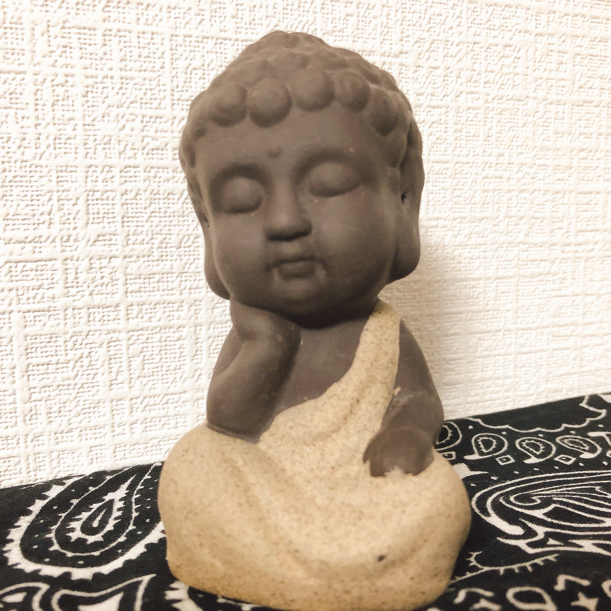

# わからないことだらけの世界を生きていく

伊藤 いづみ(@izumii19)

## まえがき

システム開発をしているとたくさんのわからないことに出会いませんか？
不具合の原因がわからない、お客様やチーム内でのコミュニケーションがわからない、さらにはわからないことがわからないなど、「システム開発は『わからない』を『わかる』にしていく作業である」といっても良いくらいたくさんのわからないことがあります。

またアジャイルの世界に身を置いていると「変化を味方につける」というフレーズをよく聞くかと思いますが、この**変化というのも新たなわからないことの一つ**と考えることができます。

今回は私がこれまでの様々な経験から見えてきた、わからないこととうまく付き合う方法をお話したいと思います。

## わからないことは永遠になくならない
**わからないことを避けるのではなく付き合う**という考え方に至ったのは、私のシングルマザーとしての経験が大きく影響しています。

結婚し子供が生まれた頃は、まさかシングルマザーになるなんて想像もしませんでした。この生活がずっと続くものと思い、子供が何歳になったらパートに出て、毎年このくらい貯金して、何年後にはマイホームを建てて…と計画し、この計画を堅実に遂行していけば良いと思っていました。

ところが現実は何もかもが想定外。予定よりだいぶ早くフルタイムワーカーに復帰し、怒涛のワンオペ育児。貯金する余裕はなく新築も新車も早々断念。想定とは全く違う人生で、彦麻呂のネタを借りるならばまさに「unknownの玉手箱や〜」です。

私はこの経験を通じて**生きることは想定外のことだらけである**ということを思い知りました。
未来は無限、すなわちわからないことも無限、しかもこれをコントロールすることは不可能。だとすれば未来に備えてチマチマと計画することや、わからないことを避ける方法ではなく、**わからないことはまず受けとめて、うまく付き合っていくべきなのでは**と思ったのです。

## わからないことと付き合うには

過去にWebエンジニアとして働いていた頃の話を例にあげます。

Webエンジニアとして初めて携わったのが「Amazon DynamoDBから特定のデータを取得し、フロント側に返すAPIをDjangoを使って作る」という業務でした。当時の私はWebAPI開発経験なし、DynamoDBの知識なし、PythonもDjangoも未経験。まわりに助けてくれる人がいないわけではないのですが、他メンバーも案件を抱えているため基本的に自分自身で船を漕いでいく必要がありました。

ですがわからないことが多すぎて、最初の一歩に何をするべきかすらわからないのです。ただただ不安な気持ちだけがずっと心にある状態が嫌でここなんとか脱出したい！と思い、やっていったことをこれから書いていきます。

### 不安という感情で自分自身を潰さない

わからないことと出会った時のみなさんの反応はどんな感じでしょう。ワクワクしますか？それとも不安でしょうか。
私は「何がなんだかわからない」のような**漠然とした状態の時ほど不安が大きい**です。そしてテンパってしまい、単純なことを大げさに受け取ったり、本質を捉えることができずに余計に問題を複雑化してしまったり。それが結果として失敗につながってしまったと思います。

脳科学者の中野信子さんによると日本人はもともと不安を感じやすい民族なのだそうです。そしてこれにはセロトニントランスポーターという遺伝子が関係しています[^nakano]。
セロトニントランスポーターには不安を感じやすい「SS型」、楽観的な「LL型」、その中間の「SL型」という３つの型があるのですが、このうち**日本人のなんと7割近くが不安を感じやすいといわれるSS型**なのだそうです[^ll]。

[^nakano]: 2020/11/5 ビジネスEXPOでの脳科学者中野信子氏によるセッション「コロナ禍のビジネスマンへ送るメッセージ〜不安な気持ちの中で“成功へ導く”考え方〜」のご講演内容より

[^ll]: ちなみに楽観的なLL型の遺伝子を持っている日本人はたった2%程度しかいないとか。

つまり、私達がわからないことにぶち当たった時にワクワクよりも不安を感じるのは遺伝的のせいと考えることができます。

この話を聞いてからは、漠然とした不安が襲ってくると「この感情は遺伝子のせいで私のせいじゃないから無視！無視！」といい聞かせました。
こうやって事実と感情を多少強引に分離することにより不安という感情に自分自身のコントロールを乗っ取られることが減り、事実を俯瞰して観察できるようになります。

### わからないことが何かを認知する
ネガティブな感情をうまく切り離したら、漠然とした「わからないこと」を「自分がわかっていること」とという視点に置き換えてみます。

* 私は**APIってどうやって作るのかわからない**ということがわかっている
* 私は**pythonやDjangoがわからない**ということがわかっている
* 私は**DynamoDBがわからない**ということがわかっている

ここに↑を表現する図をいれる
ここに↑を表現する図をいれる
ここに↑を表現する図をいれる
ここに↑を表現する図をいれる
ここに↑を表現する図をいれる
ここに↑を表現する図をいれる
ここに↑を表現する図をいれる
ここに↑を表現する図をいれる

**私は自分のわからないことがわかっている**という自己認知の視点に切り替えることで、わからないことを浮き彫りにします。漠然とした不安をもたらしていたものの正体が見えてくると次の一手が見えてきて、不安な気持ちが少なくなってきます。

### わからないことの解像度をあげる
次にわからないことの解像度をあげていきます。たとえば「pythonやDjangoわからない」については「本当に何もわからないんだっけ？」と自問しながら深掘っていきます。

* forやifなど処理の文法は、どの言語も似てるだろうからなんとかなりそう
* python特有の書き方は、ググってコピペでいけそうな気がする
* pythonからDynamoDBに接続する方法は全くわからん
* Webアプリケーションのフレームワークについては全然知識がない

こうして見ていくとpythonそのものについては、実際なんとかなりそうなのものを初めてというだけで不安になっていたのでした。ただの妄想ですね。逆にDynamoDBやDjangoについては本当に知識ゼロだということも見えたのでこれは策を考える必要がありそうです。こうして自分がわからないと思っていることを**事実のunknown**と**妄想のunknown**に分別していきます。

### 「わかった」にするための行動考える
最後にわからないことを解決するための具体的なアクションを考え、実行します。

↓ここは図で表現する
* pythonからDynamoDBに接続する方法がわかるためには
   * DynamoDBについてまず理解する
      * ネット、AWS公式で調べる
   * pythonからDynamoDBに接続する方法について理解する
      * Qiitaや技術ブロクを使って調べる
      * 誰かに聞く
         * 自分が理解したい答えを明確にする
         * そのためになにを質問すればよいか考える
         * わかりそうな人を探す
   * わかったら試す
   * 知っている人に丸投げ

自分がすぐ行動できそうなできそうなことからまずやってみることをオススメします。**考えたアクションは最初は「仮説」でしかないのですが、行動することによって解決できた／できなかったという「事実」に変えることができる**からです。事実というのは「わかったこと」ですから、行動によってわからないことを1つ減らしたことになります。すなわち不安をやっつけたということですね。あとは繰り返していきます。

## わからないことと共存するということ
ここまでをまとめると、わからないこととうまく付き合うプロセスは以下の通りです。

1. 不安を感じるのは遺伝子のせいと捉え、ネガティブな感情を切り離す
2. **わからないことがわかっている**ということ視点で自己認知をする
3. **事実のunknown**と**妄想のunknown**を分別
4. **事実のunknown**に対し自分のとれるアクションを考え行動する

もしこの先、わからないことに出会い漠然とした不安を感じたらこの４ステップを試してみてください。不安というネガティブな感情が「なんとかなるかも」というポジティブな感情へなだらかに変化していくのを感じられるかと思います。

わからないことが多いほど「誰かがやってくれるかも」「なにかの間違いじゃないか」という逃避型の思考になってしまいがちですが、逃避型の思考は行動に直結しにくいものです。結局のところ**行動なきところには変化も起きないため、全ては自分事として受け止め行動することに尽きる**のだと思います。「このままでは、ずっとこのままだ。」と口にしてみてください。次の瞬間、きっとあなたは何か行動したくなっているはずです。

私の人生は「もう少し早くこのことに気付けていたら自分の人生はもっと違ったかも」という後悔ばかりですが、私の人生で気づいたことが未来あるみなさんのヒントになれば幸いです。

#### 伊藤 いづみ(@izumii19)

伊藤 いづみ @izumii19 https://twitter.com/izumii19

クリエーションライン株式会社のスクラムマスター。アジャイル札幌、Women in Agile Japan Regionの運営メンバー。ScrumFestSapporo2020,2021 および ScrumFestNiigata2022実行委員。娘2人、猫1匹と北海道で暮らしています。
