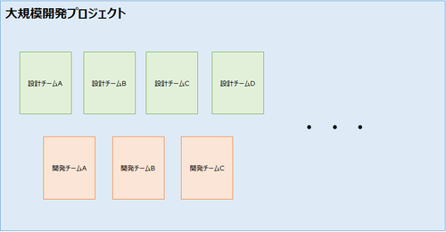
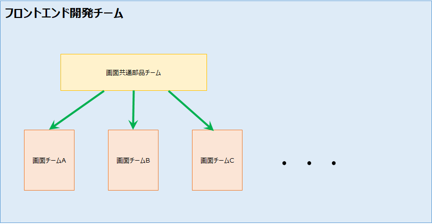

# 巨大な縦割りプロジェクトの中の小さなアジャイル

## はじめに
普段私はエンジニアや現場リーダーとして開発に携わっていますが、  
今回のお話は私が最近まで携わっていたプロジェクトのお話になります。  

### 巨大なウォーターフォールプロジェクト
このプロジェクトはとても巨大で、私自身も2年間在籍していたにも関わらず全体像がよく分からないほどでした。（笑）  

こんな感じで縦割りのチームが何チームも存在しています。  
プロジェクト全体の開発手法はいわゆるウォーターフォールです。
設計部隊と実装部隊が分かれていて、設計部隊が設計した内容で実装部隊が実装&単体テストを実施するという流れになります。
各チームのリーダーがスケジュールを作成し、ガントチャートを引いてスケジュールを管理していきます。

### フロントエンド開発チーム
この中で私は所属していたフロントエンド開発チームに所属していました。

フロントエンドチームは更に細分化されており、画面チームA、画面チームB、画面チームC・・・  
といった感じでチームが分かれているのですが、各画面チームに対して画面の共通部品を提供するチーム（以下、共通部品チームと呼称）があります。  
（ちなみに私は画面チームCのチームリーダーを担当）

### ガントチャートが引けない共通部品チーム
このチームは他チームとは異なり、各画面チームから報告されたバグや、機能追加等のエンハンスを行っていくのですが、
対応しなければならないIssueは日々変動し、優先順位も刻々と変わっていきます。
各開発チームが必要とするためリリースも頻繁に行わなければならず、スピード感が求められます。
都度やることが変わっていく中でガントチャートを引いてスケジュールをアップデートしていくのは現実的でしょうか？
それをやろうとするとガントチャートを引く職人が専用で必要になります。絶対無理ですよね。（笑）

### アジャイル開発の導入
そこでフロントエンド開発チーム全体を統括するリーダーはこの共通部品チームに限って
アジャイルでまわしていくことを決意しました。

チームリーダーから与えられたミッションはざっくりと以下の通りです。
- 各画面開発チームとコミュニケーションを取りながらIssueの優先度を決定していく
- 日々変わっていくIssueの優先度に対して柔軟に対応する
- リリースのスピードを上げ、各画面チームの生産性向上に貢献する
- 朝会等のチームのイベントを自分たちでまわしていく
- 毎週ふりかえりを行い、チームのプロセス改善につなげていく

まさにスクラムですね！ということで私はこのアジャイルチームの立ち上げに協力することになりました。

## 大事だったこと
（検討中）

## 苦労したこと
（検討中）

## まとめ
（検討中）
