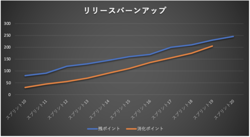

# 巨大な縦割りプロジェクトの中の小さなアジャイル

## はじめに
普段私はエンジニアや現場リーダーとして開発に携わっていますが、  
今回のお話は私が最近まで携わっていたプロジェクトのお話になります。  

### 巨大なウォーターフォールプロジェクト
このプロジェクトはとても巨大で、私自身も2年間在籍していたにも関わらず全体像がよく分からないほどでした（笑）。

こんな感じで縦割りのチームが何チームも存在しています。プロジェクト全体の開発手法はいわゆるウォーターフォールです。設計部隊と実装部隊が分かれていて、設計部隊が設計した内容で実装部隊が実装&単体テストを実施するという流れになります。各チームのリーダーがスケジュールを作成し、ガントチャートを引いてスケジュールを管理していきます。

### フロントエンド開発チーム
この中で私は所属していたフロントエンド開発チームに所属していました。

フロントエンドチームは更に細分化されており、画面チームA、画面チームB、画面チームC・・・  
といった感じでチームが分かれているのですが、各画面チームに対して画面の共通部品を提供するチーム（以下、共通部品チームと呼称）があります。  
（ちなみに私は画面チームCのチームリーダーを担当）

### ガントチャートが引けない共通部品チーム
このチームは他チームとは異なり、各画面チームから報告されたバグや、機能追加等のエンハンスを行っていくのですが、対応しなければならないIssueは日々変動し、優先順位も刻々と変わっていきます。各開発チームが必要とするためリリースも頻繁に行わなければならず、スピード感が求められます。都度やることが変わっていく中でガントチャートを引いてスケジュールをアップデートしていくのは現実的でしょうか？それをやろうとするとガントチャートを引く職人が専用で必要になります。絶対無理ですよね（笑）。

### アジャイル開発の導入
そこでフロントエンド開発チーム全体を統括するリーダーはこの共通部品チームに限ってアジャイルでまわしていくことを決意しました。

チームリーダーから与えられたミッションはざっくりと以下の通りです。
- 各画面開発チームとコミュニケーションを取りながらIssueの優先度を決定していく
- 日々変わっていくIssueの優先度に対して柔軟に対応する
- リリースのスピードを上げ、各画面チームの生産性向上に貢献する
- 朝会等のチームのイベントを自分たちでまわしていく
- 毎週ふりかえりを行い、チームのプロセス改善につなげていく

まさにスクラムですね！ということで私はこのアジャイルチームの立ち上げに協力することになりました。

## 大事だったこと
このプロジェクトにおいて特に大事だなと思ったことを3つ紹介します。

### ウォーターフォールプロジェクトに合ったリズムを作る
まず大事なことは、プロジェクト全体はウォーターフォールで動いていることを前提に考えなければなりません。ウォーターフォールプロジェクトと言えば進捗定例会はつきものですよね。今回のプロジェクトでは週一回・月曜日に週次進捗定例会を実施しており、フロントエンドチーム内の各チーム毎に進捗報告を実施しています。よって共通部品チームも例外なくこの進捗定例会に出席して毎週進捗を報告しなければなりません。このチームにとってはとても大事なイベントです！

ということでこのチームでは以下のような感じでスプリントをまわしていました。

進捗定例会を軸に他のイベントの時間割を決めていきました。

### バーンアップチャートとトレンドの把握
フロントエンドチーム内の各チームはガントチャートを基準にチームの進捗を報告するのですが、共通部品チームにガントチャートはありません。

というか作れないのです。

Issueの数は目まぐるしく変わっていきます（増えることがほとんどですが）。優先度も刻々と変化していく中でガントチャートを引くことは現実的ではありません。そこで共通部品チームではリリースバーンアップチャートを作り、チームの状況を可視化できるようにしました。前述の通りバックログの数は日々増えていくため、バーンダウンではなくバーンアップを選択しました。ではここで共通部品チームが直面した3つのトレンドについてご紹介します。

#### パターン①

（参考情報）
- 青線がバックログの残ポイント数です。
- オレンジ線がチームが消化したポイントの合計です。

これは理想的な状態のバーンアップですね。残ポイント、消化ポイントともに増えていっていますが、差が縮まってきています。残ポイントの増加は減らないにしても、チームの消化が追いついてくれば追加されたバックログも早く対応できそうですね。ゴールも近そうです。

#### パターン②

次に、こんなバーンアップではいかがでしょうか？

これはかなり厳しいですね。増加分に対して消化が全く追いついておらず、逆に差が広がっています。通称「ワニの口」状態と呼んでいました。トレンドがこのような状態が続くのであれば何か対策を打たなければなりません。

まずチームで対策できそうなことを考えてみます。
- バックログが増えている原因の究明は必須
  - 障害が原因であればなぜ障害が増えているのかの根本原因を話し合う。
  - エンハンス系のバックログであればある程度仕方ないものの、まだIssueとして起票されていないバックログはないか話し合ってみる。
- ベロシティを上げるためにできることはないか
  - チーム活動の障壁となっている何かがあれば取り除く。  
例えばこの作業面倒なんだけどなんでやっているのかいまいち分からない。  
→作業の必要性を議論してみて不要であれば思い切って除外してみる。
  - スキルが足りなくて難易度が低いIssueしか対応できない。  
→スキルが高い人に属人化しがちな作業を分担してできるようにしていく。  
→チーム内で勉強会を開いてチーム力を上げていく。 

それでも「ワニの口」が閉じなければマネージャーに相談して開発者を追加してみることなども考えられます。

#### パターン③

最後にこんなバーンアップはどうでしょうか？

うーむ。微妙ですね（笑）。良くもなっていないけど悪化もしていない。平行線です。これをどう見るかはチームによるとは思いますが、私ならパターン②と同じ対策は
講じた方が良いかなぁと思います。マネージャーからすれば「いつ終わんのこれ？」ですからね。共通部品チームではこのパターンのトレンドが一番多かった気がします。

大事なのは週次進捗定例会で
- バーンアップチャートは常に最新化しておき、現在のトレンドをマネージャー含め誰もが一目で把握できるような状態にしておくこと
- チームは現状を正確に報告できるようにしておき、アラートは素早く上げること

現状の問題点の見える化ができていればマネージャーも判断が可能です。開発者が足りなければ追加される可能性もありますし、現状で良しとする判断も可能性としてはあるでしょう。このあたりはアジャイル、ウォーターフォール関係ないですね！

## 苦労したこと
次に苦労したこととそれに対するトライを4つ紹介します。

### バーンアップチャートが引けない
ところで前章のバーンアップチャートの残ポイント数ってどうやって算出していたと思いますか？日々Issueが起票されるのですが（Issueは誰が起票しても良い）、共通部品チームが日々の対応に追われ、起票されたIssueを放置していたらどうなっていたでしょうか？仕様の検討ができないのはもちろんのこと、ポイントがつかないIssueが増え続けてしまいどれぐらいの残作業があるのか誰も把握できなくなってしまいます。つまりIssueの数は増えるけど青線が引けない事態になってしまうんです。

するとチャートはこんな感じになりますね。

一見すると順調そうに見えますね。ですが、裏にはまだポイントがついていない大量のIssueが・・・

#### 巨大システム故の苦悩
実は共通部品チームも一度このような状況になりかけたときがあります。当時は週一回リファインメントをやっていましたが、週一回ではとてもバックログをさばききれていませんでした。そこには巨大システムが故の苦労もありました。一つの共通部品の修正が数百画面にも影響を及ぼす恐れがあるため、リファインメントも慎重にならざるを得ません。ひとつのIssueの検討に相当時間がかかってしまうのです。

#### リファインメント回数を増やす
そこでリファインメントを週三回に増やして、仕様検討・見積もりのスピードをあげました。

最初は苦しかったですが、徐々に上述のような状況は解消していき、最後は起票されたIssueは即リファインメントして見積もれるようになりました。結果的に青線もしっかり引くことができました。また、リファインメントをしっかりしていないとプランニング時に苦労しますよね？いざプランニング始めてみたけど、このIssue何するんでしたっけ？のような状態ではプランニングが延々に終わりません。仕様検討・見積もりまでしっかりできてこそIssueは着手可能の状態にあると言えるので、リファインメントを甘くみないようにしましょう。

共通部品チームではリファインメントに時間を割くことでプランニングでは
- タスクの洗い出し
- スプリントゴールの設定

など本来やるべきことに集中できるようになりました！

### Web上に数多ある便利なサービスを自由に使えない
このアジャイルチームが発足したのは2020年10月頃です。世の中はコロナの真っ只中で、メンバーが一箇所に集まって開発するのが困難な状況でした。当然リモート開発ということになるのですが、リモートアジャイルを円滑に行うために便利なクラウド上のサービスを使いたくなるのは当然ですよね。しかし今回のプロジェクトはセキュリティの制約が特に厳しかったため、クラウド上のサービスを自由に使うことは許されおらず、クローズドな環境の中で許可されたツールのみを使用しておりました。

#### タスクかんばん
JIRAもMiroも使えませんでしたのでGitLabのボードで代用しました（GitLabは許可されており、Issueでバックログを管理していました）。ボード上でバックログを管理し、レーンを作成してToDo・Doing・Doneを可視化しました。ここまでは良かったのですが、GitLabのバージョンが古かったからか、Issueを並べ替えてバックログの優先順をつけることができませんでした。チームが何を優先してタスクを消化していけばよいのか、その拠り所がないのはとても困りました。

仕方なく、バックログの優先順を管理するためのWikiを別途作ることになりました。

本来はする必要のないバックログの二重管理が発生してしまいましたが、なんとか優先順を決定することができました。

#### ふりかえり用のボード
Miroなどを使えれば付箋を貼り出していくこともできますが、ふりかえりはWikiで代用しました。しかしWikiだとメンバーの同時編集でコンフリクトが発生すると戻すのが大変だったり、ストレスを抱えたままふりかえりしていました。こちらについてはWikiでのふりかえりを止めて、共有のファイルサーバーにディレクトリを用意して各自KPTのファイルを作っていました。

ファイル名が重複することは滅多にありませんからね。この方法は私では思いつきませんでしたが、チームの工夫が見れて感心しました。

#### リリースバーンアップチャート
こちらについてはExcelでポイントを集計をしました。表を作ってポイントを集計し、昨日の天気の算出やリリースバーンアップチャートを生成して、トレンドの分析などを行えるようにしました。

世の中便利なツールはたくさんありますが、制限のある中でもふりかえりなどを活用してチームの意見を募りながら、みんなで創意工夫してなんとか前に進めることができました。

### コミュニケーションの辛さ
続いて苦労した点はコミュニケーションです。フルリモートのチームなのでチャットでのコミュニケーションは必須なのですが、オフラインの時と違いちょっと気軽にメンバーに声をかける、みたいなことができなくなり苦労しました。またカメラオンにできない環境だったため、チームメンバーはお互いの顔を知りません。表情が見えない中でチームとして一体感を持って作業するのはなかなか難しいですよね。そんな中でもドラッカー風エクササイズをやってみるとか、雑談で盛り上がるとか、できる限りのことはチームとしてできていたと思います。

### 終わりの見えない開発の辛さ
前回前々回でもお話したことですが、Issueの半分以上は日々発生する障害対応になります。2,000画面以上に使用される共通部品ですから障害が発生するのはある意味当然と言えます。画面の開発が続いている以上、必ず障害は発生しますし、新しい機能を追加して欲しいという要望も出てきて当然です。それを2,000画面に影響を与えずに改修していくのは至難の技ですし、共通部品チームのメンバーとしても一番気を使うところだと思います。大変なプレッシャーの中で頑張っていたと思います。

チームとしてのゴールが見えていればメンバー同士一丸となって頑張れるとは思うのですが、今回のチームについては開発が続く以上終わりがありません。高い緊張感を保ちながらモチベーションを維持していくのは大変ですよね。本当はチームで懇親会など開いて英気を養う機会があれば良いのでしょうが、コロナめ！

以上、苦労したことを紹介しました。

## まとめ
そもそもこの巨大なプロジェクトの中でアジャイルを実践することがそもそもチャレンジなんですよね。苦労があって当然とも言えます。ですが為せば成るものでして、壁にぶち当たりながらもメンバー全員で協力し、前に進めることができました。アジャイル経験メンバーも初めてのメンバーも混成されたチームでしたが、メンバー全員成功体験を積んでくれたのかなと嬉しく思います。また、この巨大プロジェクトの中で一部ではありますがアジャイル開発を許容してくれたチームリーダー、マネージャーには感謝の気持ちでいっぱいです！ここで培ったアジャイルマインドが組織の根となり広がっていくことを心から願っています。