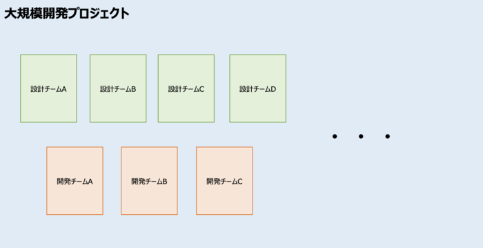
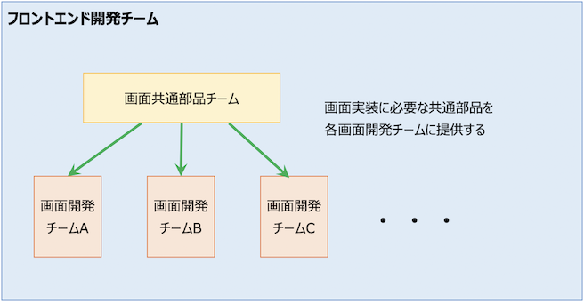
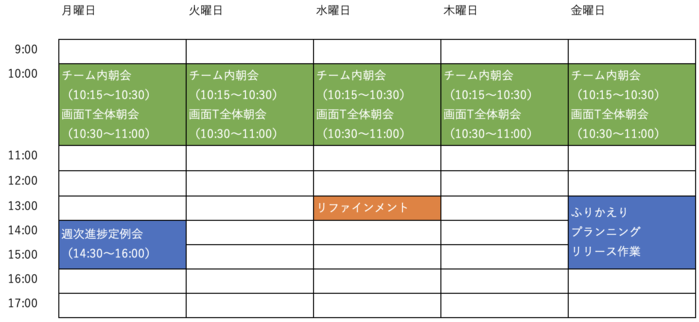
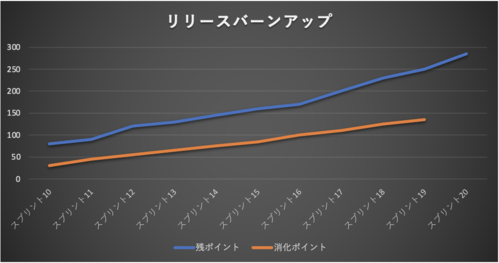
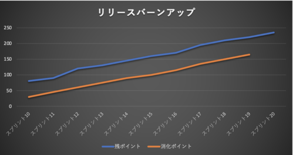

# 巨大な縦割りプロジェクトの中の小さなアジャイル（導入編）

岡島一樹(@k-okajima)

## はじめに
普段私はエンジニアや現場リーダーとして開発に携わっていますが、今回のお話は私が最近まで携わっていたプロジェクトのお話になります。  

### 巨大なウォーターフォールプロジェクト
このプロジェクトはとても巨大で、私自身も2年間在籍していたにも関わらず全体像がよく分からないほどでした（笑）。以下の図のように縦割りのチームが何チームも存在しています。プロジェクト全体の開発手法はいわゆるウォーターフォールです。設計部隊と実装部隊が分かれていて、設計部隊が設計した内容で実装部隊が実装&単体テストを実施するという流れになります。各チームのリーダーがスケジュールを作成し、ガントチャートを引いてスケジュールを管理していきます。

### フロントエンド開発チーム
この中で私は所属していたフロントエンド開発チームに所属していました。フロントエンドチームは画面チームA、画面チームB、画面チームC・・・といった感じで更にチームが細分化されているのですが、今回フォーカスするのは各画面チームに対して画面の共通部品を提供するチーム（以下、共通部品チームと呼称）です。ちなみに私は画面チームCのチームリーダーを担当しておりました。

### ガントチャートが引けない共通部品チーム
このチームは他チームとは異なり、各画面チームから報告されたバグや、機能追加等のエンハンスを行っていくのですが、対応しなければならないIssueは日々変動し、優先順位も刻々と変わっていきます。各開発チームが必要とするためリリースも頻繁に行わなければならず、スピード感が求められます。都度やることが変わっていく中でガントチャートを引いてスケジュールをアップデートしていくのは現実的でしょうか？それをやろうとするとガントチャートを引く職人が専用で必要になります。絶対無理ですよね（笑）。

### アジャイル開発の導入
そこでフロントエンド開発チーム全体を統括するリーダーはこの共通部品チームに限ってアジャイルでまわしていくことを決意しました。チームリーダーから与えられたミッションはざっくりと以下の通りです。
- 各画面開発チームとコミュニケーションを取りながらIssueの優先度を決定していく
- 日々変わっていくIssueの優先度に対して柔軟に対応する
- リリースのスピードを上げ、各画面チームの生産性向上に貢献する
- 朝会等のチームのイベントを自分たちでまわしていく
- 毎週ふりかえりを行い、チームのプロセス改善につなげていく

まさにスクラムですね！ということで私はこのアジャイルチームの立ち上げに協力することになりました。

## 大事だったこと
ではここで、このプロジェクトにおいて特に大事だなと思ったことを3つ紹介します。

### ウォーターフォールプロジェクトに合ったリズムを作る
まず大事なことは、プロジェクト全体はウォーターフォールで動いていることを前提に考えなければなりません。ウォーターフォールプロジェクトと言えば進捗定例会はつきものですよね。今回のプロジェクトでは週一回・月曜日に週次進捗定例会を実施しており、フロントエンドチーム内の各チーム毎に進捗報告を実施しています。よって共通部品チームも例外なくこの進捗定例会に出席して毎週進捗を報告しなければなりません。ということでこのチームでは以下のように月曜日の進捗定例会を軸に他のイベントの時間割を決めてスプリントを回しました。

### バーンアップチャートとトレンドの把握
フロントエンドチーム内の各チームはガントチャートを基準にチームの進捗を報告するのですが、前述した通り共通部品チームにはガントチャートはありません。そこでこのチームではリリースバーンアップチャートを作り、チームの状況を可視化できるようにしました。バックログの数は日々増えていくため、バーンダウンではなくバーンアップを選択しました。ではここで共通部品チームが直面した3つのトレンドについてご紹介します。

#### パターン①

（参考情報）
- 青線がバックログの残ポイント数です。
- オレンジ線がチームが消化したポイントの合計です。

これは理想的な状態のバーンアップですね。残ポイント、消化ポイントともに増えていっていますが、差が縮まってきています。残ポイントの増加は減らないにしても、チームの消化が追いついてくれば追加されたバックログも早く対応できそうですね。ゴールも近そうです。

#### パターン②

次に、こんなバーンアップではいかがでしょうか？これはかなり厳しいですね。増加分に対して消化が全く追いついておらず、逆に差が広がっています。通称「ワニの口」状態と呼んでいました。トレンドがこのような状態が続くのであれば何か対策を打たなければなりません。

まずチームで対策できそうなことを考えてみます。例えばバックログが増えている原因の究明は必須です。障害が原因であればなぜ障害が増えているのかの根本原因を話し合いましょう。エンハンス系のバックログであればある程度仕方ないものの、まだIssueとして起票されていないバックログはないか話し合ってみることも必要です。次にベロシティを上げるためにできることはないか考えてみます。例えば必要性を感じない割に面倒な作業がもしあれば、タスクから思い切って除外してみるのも良いでしょう。メンバーのスキルが平準化されておらず一部のメンバーに負荷が偏っているような場合は、チーム内勉強会などでチーム力の底上げを図るのも良いでしょう。

それでも「ワニの口」が閉じなければマネージャーに相談して開発者を追加してみることなども考えられます。

#### パターン③

最後にこんなバーンアップはどうでしょうか？うーむ。微妙ですね（笑）。良くもなっていないけど悪化もしていない。平行線です。これをどう見るかはチームによるとは思いますが、私ならパターン②と同じ対策は講じた方が良いかなぁと思います。マネージャーからすれば「いつ終わんのこれ？」ですからね。共通部品チームではこのパターンのトレンドが一番多かった気がします。大事なのは以下2点を明確化した上で週次進捗定例会に臨むことです。

- バーンアップチャートは常に最新化しておき、現在のトレンドをマネージャー含め誰もが一目で把握できるような状態にしておくこと。
- チームは現状を正確に報告できるようにしておき、アラートは素早く上げること。

現状の問題点の見える化ができていればマネージャーも判断が可能です。開発者が足りなければ追加される可能性もありますし、現状で良しとする判断も可能性としてはあるでしょう。このあたりはアジャイル、ウォーターフォール関係ないですね！
