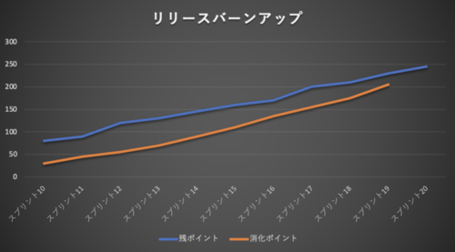
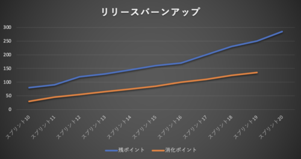
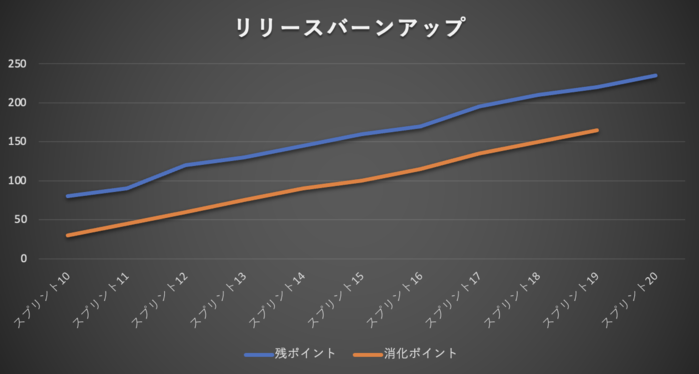

# 巨大な縦割りプロジェクトの中の小さなアジャイル（進捗定例会の臨み方）

岡島一樹(@k-okajima)

## バーンアップチャートとトレンドを把握し進捗定例会に臨むべし
フロントエンドチーム内の各チームはガントチャートを基準にチームの進捗を報告するのですが、前述した通り共通部品チームにはガントチャートはありません。そこでこのチームではリリースバーンアップチャートを作り、チームの状況を可視化できるようにしました。バックログの数は日々増えていくため、バーンダウンではなくバーンアップを選択しました。ではここで共通部品チームが直面した3つのトレンドについてご紹介します。

### トレンド①

（参考情報）
- 青線がバックログの残ポイント数です。
- オレンジ線がチームが消化したポイントの合計です。

これは理想的な状態のバーンアップですね。残ポイント、消化ポイントともに増えていっていますが、差が縮まってきています。残ポイントの増加は減らないにしても、チームの消化が追いついてくれば追加されたバックログも早く対応できそうですね。ゴールも近そうですので、進捗定例会では堂々と「問題ありません」と報告しましょう。

### トレンド②

次に、こんなバーンアップではいかがでしょうか？これはかなり厳しいですね。増加分に対して消化が全く追いついておらず、逆に差が広がっています。通称「ワニの口」状態と呼んでいました。トレンドがこのような状態が続くのであれば何か対策を打たなければなりません。

まずチームで対策できそうなことを考えてみます。例えばバックログが増えている原因の究明は必須です。障害が原因であればなぜ障害が増えているのかの根本原因を話し合いましょう。エンハンス系のバックログであればある程度仕方ないものの、まだIssueとして起票されていないバックログはないか話し合ってみることも必要です。次にベロシティを上げるためにできることはないか考えてみます。例えば必要性を感じない割に面倒な作業がもしあれば、タスクから思い切って除外してみるのも良いでしょう。メンバーのスキルが平準化されておらず一部のメンバーに負荷が偏っているような場合は、チーム内勉強会などでチーム力の底上げを図るのも良いでしょう。

それでも「ワニの口」が閉じなければチームだけではどうにもできません。マネージャーに相談しメンバーを追加するなどの対策が必要です。大事なのはこのトレンドが続くようであれば、進捗定例会では特大級のアラートを上げる必要があるということです。

### トレンド③

最後にこんなバーンアップはどうでしょうか？うーむ。微妙ですね（笑）。良くもなっていないけど悪化もしていない。平行線です。これをどう見るかはチームによるとは思いますが、私ならパターン②と同じ対策は講じた方が良いかなぁと思います。マネージャーからすれば「いつ終わんのこれ？」ですからね。共通部品チームではこのパターンのトレンドが一番多かった気がします。大事なのはバーンアップチャートは常に最新化しておき、現在のトレンドをマネージャーが一目で把握できるような状態にしておくことです。現状の問題点の見える化ができていればマネージャーも判断が可能です。開発者が足りなければ追加される可能性もありますし、現状で良しとする判断も可能性としてはあるでしょう。

## 改めて思う進捗報告で大事なこと
私自身はウォーターフォールの経験がとても長いのですが、結局のところ進捗の見える化はとても大事だなと改めて思いました。それはアジャイルだろうがウォーターフォールだろうが関係ないです。今回のこのチームであればバーンアップチャートを進捗の見える化のために上手に活用して、関係者間で認識の齟齬がないように工夫することで、より良いコミュニケーションを図ることが何よりも重要でした。このチーム以外はガントチャートベースの報告をしているので報告内容に情報の欠落があってはいけませんし、もちろん嘘ついて良いように見せるのもいけません（笑）。
