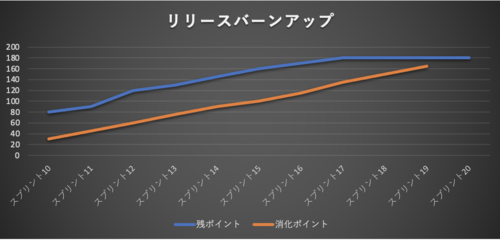
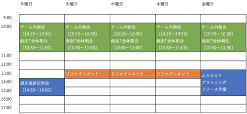

# 巨大な縦割りプロジェクトの中の小さなアジャイル（Problem&Try編）

岡島一樹(@k-okajima)

## 苦労したこと
導入編の続きです。今回は苦労したこととそれに対してトライしたことをご紹介します。

### バーンアップチャートが引けない
前章のバーンアップチャートの残ポイント数ですが、どうやって算出していたと思いますか？日々Issueが起票されるのですが、共通部品チームが日々の対応に追われ、起票されたIssueを放置していたらどうなっていたでしょうか？仕様の検討ができないのはもちろんのこと、ポイントがつかないIssueが増え続けてしまいどれぐらいの残作業があるのか誰も把握できなくなってしまいます。つまりIssueの数は増えるけど青線が引けない事態になってしまうんです。するとチャートはこんな感じになりますね。

一見すると順調そうに見えますね。ですが、裏にはまだポイントがついていない大量のIssueが・・・

#### 巨大システム故の苦悩
実は共通部品チームも一度このような状況になりかけたときがあります。当時は週一回リファインメントをやっていましたが、週一回ではとてもバックログをさばききれていませんでした。そこには巨大システムが故の苦労もありました。一つの共通部品の修正が数百画面にも影響を及ぼす恐れがあるため、リファインメントも慎重にならざるを得ません。ひとつのIssueの検討に相当時間がかかってしまうのです。

#### リファインメント回数を増やす
そこで以下の図のようにリファインメントを週三回に増やして、仕様検討・見積もりのスピードをあげました。

最初は苦しかったですが、徐々に上述のような状況は解消していき、最後は起票されたIssueは即リファインメントして見積もれるようになりました。結果的に青線もしっかり引くことができました。また、リファインメントをしっかりしていないとプランニング時に苦労しますよね？いざプランニング始めてみたけど、このIssue何するんでしたっけ？のような状態ではプランニングが詰みます。リファインメントを甘くみないようにしましょう。リファインメントに時間を割くことでプランニングでは、タスクの洗い出し、スプリントゴールの設定など、本来やるべきことに集中できるようになりました。

### Web上に数多ある便利なサービスを自由に使えない
このアジャイルチームが発足したのは2020年10月頃です。世の中はコロナの真っ只中で、メンバーが一箇所に集まって開発するのが困難な状況でした。当然リモート開発ということになるのですが、リモートアジャイルを円滑に行うために便利なクラウド上のサービスを使いたくなるのは当然ですよね。しかし今回のプロジェクトはセキュリティの制約が特に厳しかったため、クラウド上のサービスを自由に使うことは許されおらず、クローズドな環境の中で許可されたツールのみを使用しておりました。

#### タスクかんばん
JIRAもMiroも使えませんでしたのでGitLabのボードで代用しました（GitLabは許可されており、Issueでバックログを管理していました）。ボード上でバックログを管理し、レーンを作成してToDo・Doing・Doneを可視化しました。ここまでは良かったのですが、GitLabのバージョンが古かったからか、Issueを並べ替えてバックログの優先順をつけることができませんでした。チームが何を優先してタスクを消化していけばよいのか、その拠り所がないのはとても困りました。仕方なく、バックログの優先順を管理するためのWikiを別途作ることになりました。本来はする必要のないバックログの二重管理が発生してしまいましたが、なんとか優先順を決定することができました。

#### ふりかえり用のボード
Miroなどを使えれば付箋を貼り出していくこともできますが、ふりかえりはWikiで代用しました。しかしWikiだとメンバーの同時編集でコンフリクトが発生すると戻すのが大変だったり、ストレスを抱えたままふりかえりしていました。こちらについてはWikiでのふりかえりを止めて、共有のファイルサーバーにディレクトリを用意して各自KPTのファイルを作っていました。ファイル名が重複することは滅多にありませんからね。この方法は私では思いつきませんでしたが、チームの工夫が見れて感心しました。

#### リリースバーンアップチャート
こちらについてはExcelでポイントを集計をしました。表を作ってポイントを集計し、昨日の天気の算出やリリースバーンアップチャートを生成して、トレンドの分析などを行えるようにしました。

世の中便利なツールはたくさんありますが、制限のある中でもふりかえりなどを活用してチームの意見を募りながら、みんなで創意工夫してなんとか前に進めることができました。

### コミュニケーションの辛さ
続いて苦労した点はコミュニケーションです。フルリモートのチームなのでチャットでのコミュニケーションは必須なのですが、オフラインの時と違いちょっと気軽にメンバーに声をかける、みたいなことができなくなり苦労しました。またカメラオンにできない環境だったため、チームメンバーはお互いの顔を知りません。表情が見えない中でチームとして一体感を持って作業するのはなかなか難しいですよね。そんな中でもドラッカー風エクササイズをやってみるとか、雑談で盛り上がるとか、できる限りのことはチームとしてできていたと思います。

### 終わりの見えない開発の辛さ
前回前々回でもお話したことですが、Issueの半分以上は日々発生する障害対応になります。2,000画面以上に使用される共通部品ですから障害が発生するのはある意味当然と言えます。画面の開発が続いている以上、必ず障害は発生しますし、新しい機能を追加して欲しいという要望も出てきて当然です。それを2,000画面に影響を与えずに改修していくのは至難の技ですし、共通部品チームのメンバーとしても一番気を使うところだと思います。大変なプレッシャーの中で頑張っていたと思います。

チームとしてのゴールが見えていればメンバー同士一丸となって頑張れるとは思うのですが、今回のチームについては開発が続く以上終わりがありません。緊張感を保ちながらモチベーションを維持していくのは大変ですよね。本当はチームで懇親会など開いて英気を養う機会があれば良かったのですが、コロナめ！

## まとめ
以上で今回の話は終わりです。そもそもこの巨大なプロジェクトの中でアジャイルを実践することがそもそもチャレンジなんですよね。苦労があって当然とも言えます。ですが為せば成るものでして、壁にぶち当たりながらもメンバー全員で協力し、前に進めることができました。アジャイル経験メンバーも初めてのメンバーも混成されたチームでしたが、メンバー全員成功経験を積んでくれたのかなと嬉しく思います。また、この巨大プロジェクトの中で一部ではありますがアジャイル開発を許容してくれたチームリーダー、マネージャーには感謝の気持ちでいっぱいです！ここで培ったアジャイルマインドが組織の根となり広がっていくことを心から願っています。