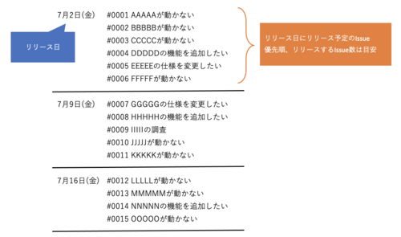
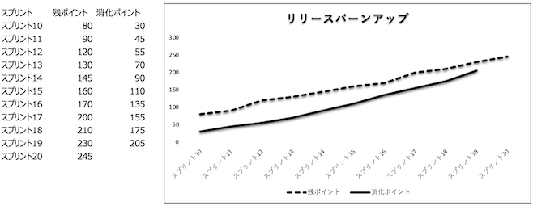
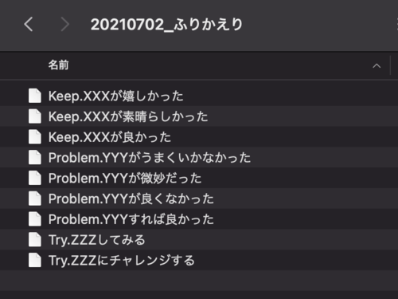

# 巨大な縦割りプロジェクトの中の小さなアジャイル（スクラムを成立させるために工夫したこと）

岡島一樹(@k-okajima)

## バーンアップチャートを引く際の心構え
進捗の見える化にバーンアップチャートを活用する場合、バーンアップチャートの残ポイント数を算出することは欠かせません。よって日々起票されたIssueをすぐにポイント見積もりしてバーンアップチャートに反映する必要があります。

### 一見順調に見えるバーンアップチャート
仮に共通部品チームが日々の対応に追われ、起票されたIssueを放置していたらどうなっていたでしょうか？ポイントがつかないIssueが増え続けてしまい、どれぐらいの残作業があるのか誰も把握できなくなってしまいます。つまりIssueの数は増えるけど青線が引けない事態になってしまいます。するとチャートはこんな感じになります。

一見すると順調そうに見えますね。ですが、裏にはまだポイントがついていない大量のIssueが・・・実は共通部品チームも一度このような状況になりかけたときがあります。当時は週一回リファインメントをやっていましたが、週一回ではとてもバックログをさばききれていませんでした。そこには巨大システムが故の苦労もありました。一つの共通部品の修正が数百画面にも影響を及ぼす恐れがあるため、リファインメントも慎重にならざるを得ません。ひとつのIssueの検討に相当時間がかかってしまうのです。

### リファインメント回数を増やす
そこで以下の図のようにリファインメントを週三回に増やして、仕様検討・見積もりのスピードをあげました。足りなければ増やす。ただそれだけのことなのですが、すごく効果は大きかったように思います。

最初はやってもやってもIssueの増加分にリファインメントが追いつかず、リファインメント地獄で苦しんでいましたが、徐々に上述のような状況は解消していき、最後は起票されたIssueは即リファインメントして見積もれるようになりました。結果的に青線もしっかり引くことができました。また、リファインメントができてない状態でプランニングに突入すると、このIssue何するんでしたっけ？となってしまいプランニング時に苦労したので、リファインメント回数を増やしたのは良かったです。

## Web上の便利なサービスを自由に使えない場合の対処法
ところでこのアジャイルチームが発足したのは2020年10月頃です。世の中はコロナの真っ只中で、メンバーが一箇所に集まって開発するのが困難な状況でした。当然リモート開発ということになるのですが、リモートアジャイルを円滑に行うために便利なクラウド上のサービスを使いたくなるのは当然ですよね。しかし今回のプロジェクトはセキュリティの制約が特に厳しかったため、クラウド上のサービスを自由に使うことは許されおらず、クローズドな環境の中で許可されたツールのみを使用しておりました。しかし制限のある中でもふりかえりなどを活用してチームの意見を募りながら、みんなで創意工夫してなんとか前に進めることができましたのでいくつか紹介します。

### タスクかんばんはGitLabとWikiで
JIRAもMiroも使えませんでしたのでGitLabのボードで代用しました（GitLabは許可されており、Issueでバックログを管理していました）。ボード上でバックログを管理し、レーンを作成してToDo・Doing・Doneを可視化しました。ここまでは良かったのですが、GitLabのバージョンが古かったからか、Issueを並べ替えてバックログの優先順をつけることができませんでした。チームが何を優先してタスクを消化していけばよいのか、その拠り所がないのはとても困りました。仕方なく、バックログの優先順を管理するためのWikiを別途作ることになりました。IssueとWikiで二重管理が発生してしまいましたが、なんとか優先順を決定することができました。

### リリースバーンアップチャートはExcelを活用
リリースバーンアップチャートは実はExcelでポイントを集計してグラフを作成していました。ここでもIssueとExcelの二重管理状態となりましたが、チャートの見える化を優先しました。

### ふりかえり用のボードは斬新な方法で
Miroなどを使えれば付箋を貼り出していくこともできますが、ふりかえりはWikiで代用しました。しかしWikiだとメンバーの同時編集でコンフリクトが発生すると戻すのが大変だったり、ストレスを抱えたままふりかえりしていました。こちらについてはWikiでのふりかえりを止めて、共有のファイルサーバーにディレクトリを用意して各自KPTのファイルを作っていました。ファイル名が重複することは滅多にありませんからね。この方法は私では思いつきませんでしたが、チームの工夫が見れて感心しました。

## まとめ
以上で今回の話は終わりです。そもそもこの巨大なプロジェクトの中でアジャイルを実践することがそもそもチャレンジなんですよね。苦労があって当然とも言えます。ですが為せば成るものでして、壁にぶち当たりながらもメンバー全員で協力し、前に進めることができました。アジャイル経験メンバーも初めてのメンバーも混成されたチームでしたが、メンバー全員成功経験を積んでくれたのかなと嬉しく思います。また、この巨大プロジェクトの中で一部ではありますがアジャイル開発を許容してくれたチームリーダー、マネージャーには感謝の気持ちでいっぱいです！ここで培ったアジャイルマインドが組織の根となり広がっていくことを心から願っています。
