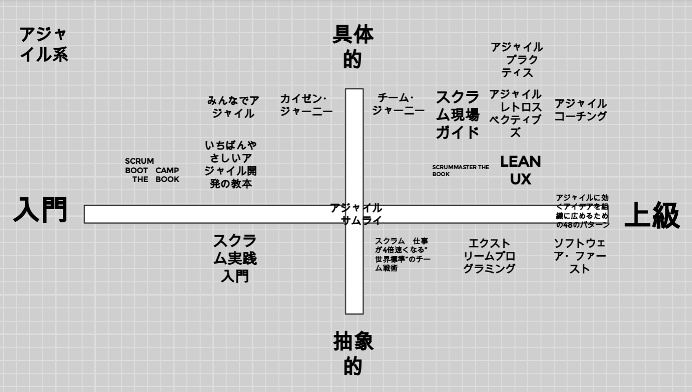

# アジャイルの始め方～化石エンジニアがアジャイルの「本の探し方」（自己流）を共有します～

ammonite_404

## テンケー！（天啓 or 典型）

4年くらい前のとあるイベントで「アジャイル」の精神に触れた（と思った）化石エンジニア・アンモナイトは、唐突に「自分はもはや化石的なエンジニア＝生きるレガシー＝駆逐される」ことを悟った。
まだローンあるのに。

## 無知の知

自分が化石エンジニアであることは理解した。「アジャイル」が好きなことも自覚した。
だから、思い切って、アジャイルイベントに参加してみたり、したのだが‐‐。

現実：「アジャイラー[^1]と会話が成立するには圧倒的にアンモナイトの知識量が足りない」

[^1]: 仮称。アジャイル開発の実践者・関係者

アジャイラーはとても勉強熱心なのである。
WF（Waterfall）でも勉強熱心な方はいるが、アジャイラーは化石から見ると、勉強が「アクティブすぎる・守備範囲が広すぎる」。

アジャイルの理論に関する本は必要性がわかる。
XP、スクラム、リーン等は知見を広げ、深めるためにインプットが絶対に必要。
他のアジャイルの実現手法もきっと同じだと想像する。

しかし、なぜアジャイルイベントの会話で「哲学」「組織論」「マーケティング論」「心理学」「文化人類学」「動物行動学」等が出てくるのだろうか？

「組織論」「心理学」「文化人類学」「動物行動学」はまだわかる。アジャイルは結局、ひとがやることなので、そちら方面の知識は必要だと感じた。
「プロダクトを作る方法」＝「アジャイル開発」と考えれば、「作る」の先、もしくは前提として「マーケティング論」も必要かもしれない。
でも「哲学」は？　未熟なアンモナイトには接点すらわからない。

いきなり全方面カバーは「1日＝24時間の世界線＆資金に限界あり」では不可能と判断、
アンモナイトはいったん、アジャイル・スクラム・ファシリテーション関係の書籍を読み漁ることにした。

## きりがない

……どういう、ことだ……。

いったいどうやってアジャイルコミュニティの方々は書籍情報をゲットしているのだ？
昨夜アンモナイトが密林で探し回り、ようやくポチった本の話題を普通に今夜している。

しかもすでにしっかり読み込まれていて、
「あそこの解釈はこうだと思う」「それはあの本にもあったよね」「（本の略称）は読んでる」という台詞が頭上を飛び交う。

アジャイラーのアンテナ、どこに立ってるの？　どういう感度で、どういう範囲なの？

長らくアジャイルをされていた方なら蓄積があるのかなと推測できるが、
「ベテランじゃないです」と自己紹介した方も、ものすっごい読書してる。間違いなく密林ハイ課金者。
「ベテランじゃないです」＝「初心者」ではない。「アンモナイトよりも高度な知識レベルの実践者」なのだ。

## やってみた

では、どうしたらいいのか？
自分のアンテナを張るしかない。感度を上げて、リサーチするしかない。
アンテナの張り方は下記4つがあると考えた。

1. 1冊目の巻末の関連書籍を読み漁る 
2. コミュニティやイベントに参加する 
3. 密林で表示されるおススメ本を買いあさる 
4. 1人の著者の本を徹底的に追う 

アンモナイトは2-4を実行。（1はURLだったり、英語論文だったりして難易度が高いものもあるため）

なお、アンモナイトは化石であり、かつ、かなりポンコツである。
正直、書籍集めはできるだけショートカットしたかった。
「これ！」という本だけをチョイスしたかった。←我慢弱い

しかし、そう簡単にいくわけがない。
「自分のレベルに合った・自分のレベルを上げてくれる本」の探し方を見つけなければならない。
Go●gle先生の使い方やショートカットキーの使い方同様、「そのひとが使いやすく・成果を上げやすい方法」でなければ、意味がない。
ゆえにアンモナイトの方法を共有しても、「使えない！」というご感想もあると思います。
というか、必然的にそうなります。

先にお詫びします。「申し訳ありません」

## 「本の探し方」説明

では、これから1-4の内容を順番に紹介します。
※自己流ゆえに、成果は保証できません！

#### 1：関連書籍から攻める
1冊目を読んだ際に、巻末の関連書籍を読み漁る

　　メリット：1冊目から得た知識を補強できる：水平方向への展開　　←→
　　デメリット：たくさんの関連書籍の中でどれが自分のレベルにあってるか判定がムズイ＆英語論文があったりする

#### 2：イベントから攻める
コミュニティやイベントに参加、LTなどでおススメ本の情報を得る

　　メリット：旬がわかる：未知の別軸への展開・おススメ本コーナーを持ってるコミュニティがあったりする
　　（※本来の趣旨であるコミュニティ・イベントにちゃんと参加すること）　　←→
　　デメリット：自分のレベルに合っているか判定がムズイ・話してる方はバックボーンありきで会話に出している

#### 3：密林を信じる
密林で表示される「アジャイル」「スクラム」関連のおススメ本を買いあさる

　　メリット：広めに探れる。密林が勝手に関連書籍を勧めてくれる　　←→
　　デメリット：ハイ課金。廃人課金。カートに入れた後、請求額に震える

#### 4：粘着する
1人の著者の本を徹底的に追う

　　メリット：その著者への理解が深まる・その著者の出版予定が分かる（垂直方向への展開）　　←→
　　デメリット：著者の研究内容・実践内容に情報が偏る可能性あり・あまりにも粘着するとファン→ストーカーへジョブチェンジする

上記4つが初心者でも可能な攻略ルートで、個人的に実行する順番は、3→2→4→1　と考えます。

まず会話の成立のために、3の「当たり前品質」の本を知らないといけない。

それから2へ突撃、他の方の意見をうかがったり、自分の解釈を発言、質疑して理解を深める。

4は2-3の間に「この著者のことをもっと知りたい・どういう方だ？」と思った時にやる。

一気に2、4が解決するのは「読書会イベントに参加」。
強制的に課題本を読み、イベントで意見・知見を共有、イベント後は密林で関連本を探しつつふりかえりになるので、ありがたい。

また、2、3は、相乗効果で、イベントでよく聞く本、密林でよく連動して表示される本は「あ、またこの本だ。外せない本なんだな」とわかるようになる。

2のイベント参加にはもう1つ大きなメリットがあって。
オンラインイベントだと「社内では使っていないツールに触れることができる」ため、新しいツールへの心理的ハードルがめっちゃ下がります。
※セキュリティとコンプライアンスにはくれぐれも注意！

たとえばzoom、Slack、GoogleMeet、Discord、Miro、Mural、Notionは会社によっては使わない。
でもイベントで使うと確実に経験値上がります。環境が変わった際に役立ちます。

「あー、これ、Miroなら瞬殺なのに」→社内でもMiro使えないか訊いてみようか。
「オンラインMTGなら背景画像があったほうがいいよな」→公式画像があるか確認してみよう。もしくは探そう。
コミュニケーションツールは、だいたいzoomのブレイクアウトルーム、録画等に似た機能があるので、ほぼチュートリアルなしで即日から機能使用可能。

## まとめ

というわけで「本の探し方」について書いてみました。

「魚が欲しいひとに、魚をあげるのではなく、魚の釣り方を教える」（By 老子）

このトピックを読まれたということは、「釣りたい気持ち」（Why)はもうありますよね。
「アジャイル用の釣り竿がわからないよ！（渓流釣り用のやつ？　それともカジキ釣るやつ？　え、リールには自動がある？　疑似餌？　なにそれ）」という問題（How）だと思います。
この投稿があなたの釣り竿になれば幸いです。

ご参考まで、アンモナイトが作った『アジャイルサムライ』を0地点とした場合の本の分布図（2021年版）をオマケに添付します。

これは忘れっぽいアンモナイトが「どんな本だっけ？」を把握するために作ったものです。
脳内の整理にもなるので、「どんな本を読んだか」というアウトプットも大事かなと思います。

ここまで長文にお付き合いいただき、ありがとうございました！
