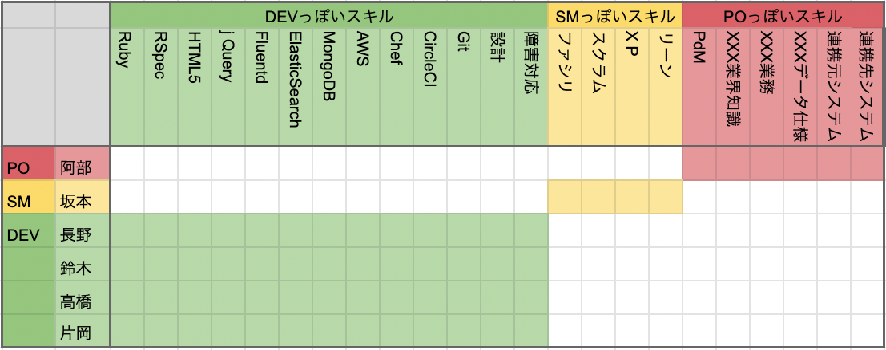
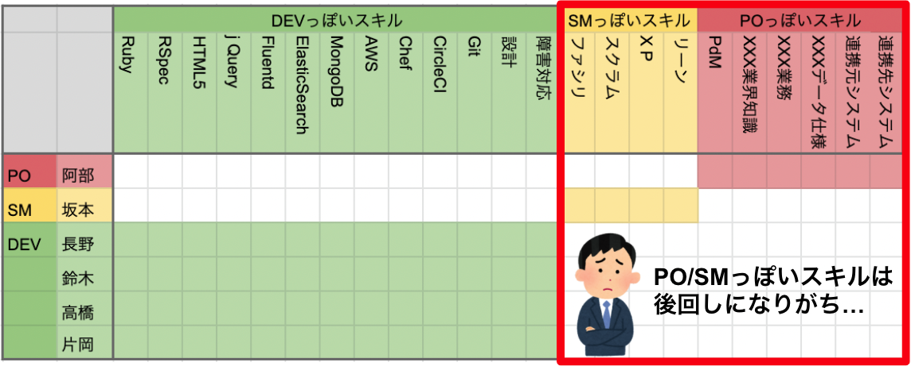

# スキルマップを使ってチームのアジリティを高めよう！

やすがひら@sonomirai

## はじめに

安ヶ平です。普段はSIerでスクラムマスターとして働いています。

メンバのスキルを星取表の形で可視化するスキルマップ。チーム発足時のメンバのスキルの可視化、離任によるリスクの可視化、学習モチベーションの向上などを目的に作成、運用しているチームは多いのではないでしょうか？

スキルマップの運用について悩んでいた際、実はスキルマップを活用することで、チームのアジリティ[^agility]を可視化したうえで、チームのアジリティ向上に繋げることができるのでは？という仮説が浮かんだので、この章で説明します。

スキルマップ自体の説明は、ryuzeeさんのブログエントリ[スキルマップ作成のすすめ](https://www.ryuzee.com/contents/blog/7065)をご覧ください。

[^agility]: この記事において「チームのアジリティ」とは、メンバが何かを提案してから、チームとして合意して具体的なアクションに繋げるまでの期間を指しています。この定義は私の勝手なイメージなで出典はないので、一般的なイメージと異なっていたらすみません。。。なおチームのアジリティという考え方は、広木さんの[『2つのDX』とDX Criteria 2021](https://dxd2021.cto-a.org/program/time-table/b-6)という講演を拝見して思いついた考え方です。

## 私なりのスキルマップの作り方

私はスクラムチーム発足時に、チームビルディングの一環として、インセプションデッキなどと共にスキルマップを作成します。チームによっては、DEVのスキルを可視化するために、DEV内でスキルマップを作成していると思います。ただ私はチームビルディングの一環としてPOと一緒にスキルマップを作成したいので、POっぽいスキルやSMっぽいスキルも含めてスキルマップを作成します。そうすると私のチームのスキルマップは、図のように、DEVっぽいスキル、SMっぽいスキル、POっぽいスキルにゾーンが分かれたスキルマップになります。

### スキルマップの運用で難しいところ

私はスキルマップを作成した後、ふりかえりの場などを活用して定期的にチームで話し合ってスキルマップを更新するのですが、このときファシリテーションが難しいと思う瞬間があります。それはSMっぽいスキル、POっぽいスキルの更新です。

DEVっぽいスキルの更新は、以下の理由で盛り上がります。

- 開発を進めることでプロダクトの理解が深まった結果、必要なスキルの解像度が上がり、スキルの項目が細分化される（例えば図の「AWS」という項目は早い段階でチームが採用しているサービス毎に細分化される）
- メンバのスキル度合いがぐんぐん向上していく
- メンバが自己評価したスキル度合いに対して、他メンバからのフィードバックが入る

それに対して、SMっぽいスキルやPOっぽいスキルの更新は以下の理由で後回しにしてしまいがちでした。

- DEVっぽいスキルの更新で時間が盛り上がって時間がなくなる
- DEVがPO/SMっぽいスキルを普段意識していないので、話題に上がりにくい
- PO/SMはスクラムチームの中だとマイノリティなので、PO/SM自身からは話題に上げづらい

このようにPOっ/SMぽいスキルの更新が後回しにしてしまった結果、POがだんだんスキルマップ更新の場に参加しなくなり、スクラムチームで共通理解を作る場が失われました。

チームビルディングのためにあえてスキルマップにPO/SMっぽいスキルを追加した私としては、これを残念に思いながらも、「そもそも役割の違うPO/SM/DEVのスキルを1つのスキルマップに表現することに無理があったのか？」と悩みました。そんな時に、前述の講演を拝見して、「チームのアジリティ」という観点で、各ロールのスキルを1つのスキルマップに意味はあると考え直せたので、次は「チームのアジリティ」について述べます。

## チームのアジリティ

唐突に話が変わるのですが、私はチームのアジリティは、メンバがお互いのロールについてどれだけ共通認識を持っているかによって決まると考えています。

DEVがPOに提案しても、POが開発のことをわかっていなかったら、説明に時間がかかります。

POがSMと会話しようにも、SMにPOを支援する度量がないと、バックログ作成が進みません。

SMがDEVにアジャイルマインドを伝えようとしても、DEVが興味なかったら開発は進みません。

チーム発足時に上記の状態だったとすると、それはチームのアジリティが低い状態です。

その後チームで会話を重ねてお互いのロールについて理解することで、チームのアジリティは向上します。

### チームのアジリティはスキルマップのどこに表れる？

さてここまでの内容で、「チームのアジリティはスキルマップのどこに表れる？」に対する私の考えがわかったでしょうか。

私は下図の通り「メンバが自分以外のロールのスキルをどれだけ有しているか」にチームのアジリティが表れると思います。

他のロールのスキルについて、高いスキル度合いを有する必要はないと思います。

ただDEVであれば、POがバックログの説明を聞いて、その裏にある業界知識や業務をイメージできる程度のスキルがあるといいし、POであれば、DEVがテストの自動化を訴えてきたときにその優先順位を判断できる程度のスキルがあるといいと思います。

## 目指したいスキルマップの運用

スキルマップを使って、メンバが他のロールのスキルをどれだけ有しているかを可視化することで、それぞれのロールに対して理解が足りないところは勉強会で補うことができ、結果としてチームのアジリティが向上すると考えているので、今後はこの点をチームメンバに伝えた上で、スクラムチーム一丸となって、改めてスキルマップを運用していきたいと思います。

## さいごに

この記事では、スキルマップを見たときに「メンバが他のロールのスキルをどの程度有しているか」を評価することで、チームのアジリティを可視化・向上させることができるのでは？という仮説を説明しました。実践して学びを得たら、また記事にしたいと思います。

