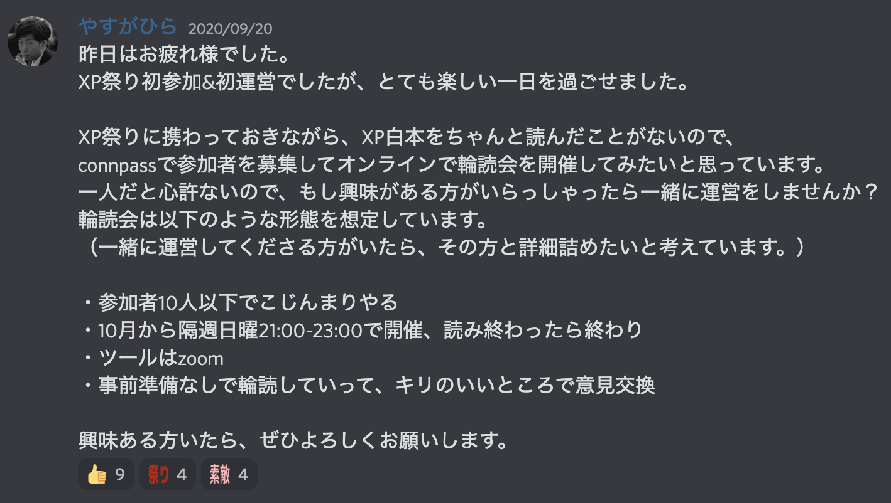

# XP会読会の紹介

やすがひら@sonomirai

## はじめに

私はXP会読会という小さな読書会を主催しています。開催日時は隔週日曜21:00-23:00で、参加者は10人前後というこじんまりとした読書会です。  
この記事では、私がこの読書会を始めたきっかけや継続できている理由などを記します。  
気軽に楽しい読書会運営を心掛けているので、この記事を読み終わる頃には、会社やコミュニティで読書会を主催してもいいかな、という気持ちになっていただけると思います。

## 始めるきっかけ

きっかけは、XP祭り2020というカンファレンスでした。この年、私は同僚の勧めでこのカンファレンスの運営に初めて参加しました。カンファレンス当日は新宿に集まり、スタッフの皆さんとコミュニケーションを取りながら各セッションの進行をしたり、プレゼント用書籍の配送準備をしたりしました。カンファレンス後は、スタッフの皆さんと食事をしながらいろいろな話をして、XPへの熱が最高潮に高まりました。  
翌朝、XPへの熱が治らない私は、翌年のXP祭りまでには原典であるXP白本を読もうと思いました。この時、一人で読んでもいいのですが、もともとアジャイル界隈の読書会には参加していて、本をいろいろな人と読み交わす楽しさは知っていたので、読書会を主催してみようかという気持ちがよぎりました。普段の私だったらコミュニティの主催なんて怖くてできないのですが、この時は、XP祭りの翌日ということもあり、私のようにXPへの熱が高まっていて、読書会を一緒に主催してくれる方がいらっしゃるかもしれないと思い、勇気を出してXP祭りの運営スタッフに宛てて、運営のお誘いをしました。

この時、手を挙げてくださったのが、@kuroさんでした。

## 初回開催に向けた準備

## 意識していること

## みんなでやる意義

## 継続できている理由

## やってよかったこと

## これから

## おわりに
